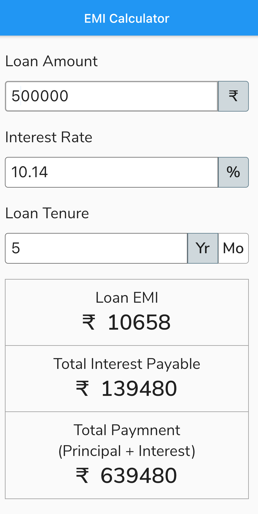
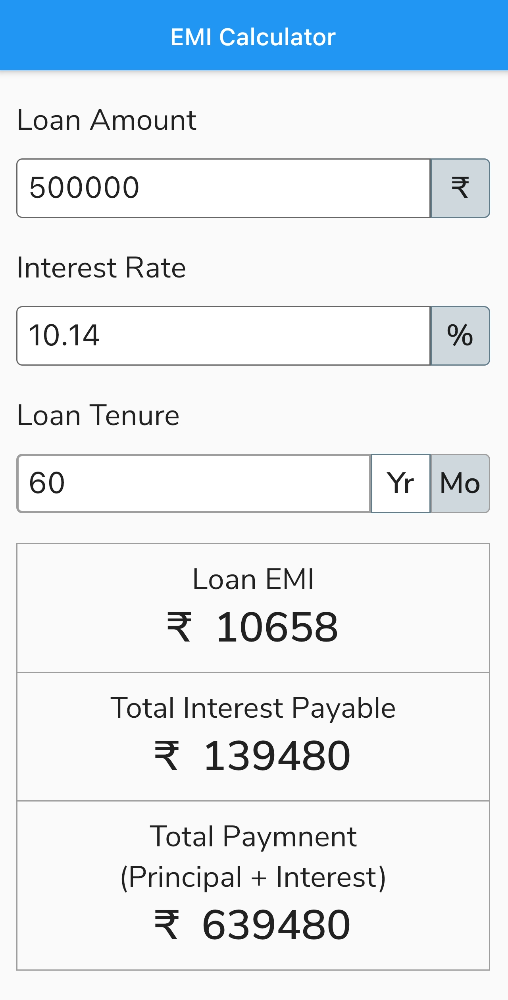

# EMI Calculator

An `Equated Monthly Installment (EMI)` is defined by Investopedia as "A fixed payment amount made by a borrower to a lender at a specified date each calendar month. Equated monthly installments are used to pay off both interest and principal each month, so that over a specified number of years, the loan is fully paid off along with interest.

## Formula

The formula for EMI is

where: P is the principal amount borrowed, A is the periodic amortization payment, r is the annual interest rate divided by 100 (annual interest rate also divided by 12 in case of monthly installments), and n is the total number of payments (for a 30-year loan with monthly payments n = 30 × 12 = 360).

## Preview

## EMI calculation on the basis of years

## EMI calculation on the basis of months

 